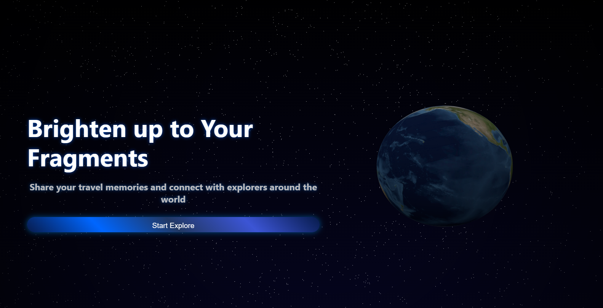

# 📸 PhotoDump (가제) - README

## 🧭 프로젝트 개요
PhotoDump은 사용자가 여행 중 촬영한 사진을 세계 지도 위에 업로드하여 해당 국가를 사진으로 채워나가는 인터랙티브한 플랫폼입니다.
시각적이고 감성적인 여행 기록 방식으로, 사용자의 세계 여행을 독려하고 공유합니다.

---


---

## 🚀 기술 스택

| 파트           | 기술                       | 설명                     |
|----------------|--------------------------|------------------------|
| 프론트엔드     | React+Vite, CSS4         | 빠른 빌드 환경과 컴포넌트 기반 UI   |
| 3D 그래픽      | **three.js**  (학습용)      | 지구, 우주 배경 등 3D 모델링에 사용 |
| 백엔드         | Node.js, Express         | RESTful API 설계         |
| 인증           | express-session, bcrypt  | 로그인 인증 + 비밀번호 암호화 처리            |
| 파일 업로드     | Multer   (예정)            | 이미지 업로드 처리 및 base64 변환           |
| 데이터베이스   | MySQL, Docker, Workbench | 사용자, 사진 데이터 저장         |
| 버전관리       | Git, GitHub              | 협업 및 버전 관리             |
| 개발도구       | WebStorm                 | 생산성 높은 개발환경            |


---

## 🌟 핵심 기능

- 🌍 세계 지도 기반 UI (국가별 클릭 및 업로드)
- 🖼 나라별 사진 업로드 및 미리보기 (base64 저장, `.webp` 변환 예정)
- 🧷 지도 위 사진 마커 (썸네일 마커 + offset 격자 배치)
- 📊 업로드 수 시각화 (컬러 또는 썸네일 증가)
- 🔍 대륙 필터 기능 (아시아, 유럽 등)
- 🔐 회원 기능 (가입, 로그인, 탈퇴, 세션 기반 인증)
- 🛠 관리자 기능 (유저/사진 관리, 통계 조회)

---

## 🔒 핵심 보안 사항

- SQL Injection 방지: Prepared Statements (인풋 유효성 검증)
- 파일 업로드 보안: MIME 검사, 용량 제한, 확장자 검사
- 세션 보안: HttpOnly 쿠키, 인증 미들웨어
- 관리자 인증 라우트 보호
- 사용자 입력 XSS 방지
- 비밀번호 해시 암호화: bcrypt 사용
- HTTPS 적용 (배포 시)
- CORS 설정 (배포 시)
- CSRF 방지 (배포 시)

---

### admin

| 필드명 |타입 |설명 |
|------|------|------|
|id|	INT (PK)	|관리자 ID|
|username|	VARCHAR	|아이디|
|password|	VARCHAR	|암호화 저장|
|role|	ENUM('admin')	|권한 구분|

### users

|필드명|	타입 |	설명 |
|------|------|------|
|id|	INT (PK)	|사용자 ID|
|username|	VARCHAR	|아이디|
|password|	VARCHAR	|암호화 저장|
|role|	ENUM('user', 'admin')	|권한 구분|
created_at|	DATETIME	|가입 시간|

### photos
| 필드명 | 	타입  |	설명 |
|-----|------|------|
|id	|INT (PK)	|사진 ID|
|user_id|	INT (FK)	|업로더|
|country_name|	VARCHAR	|나라 이름|
|photo_data|	LONGTEXT	|base64 데이터|
|travel_date|	DATE	|여행 날짜|
|created_at|	DATETIME	|업로드 시간|


### countries
| 필드명          | 	타입       | 	설명   |
|--------------|-----------|-------|
| id	          | INT (PK)	 | 나라 ID |
| name         | 	VARCHAR	 | 나라 이름 |
| code         | 	VARCHAR	 | 나라 코드 |
| region       | 	VARCHAR	 | 대륙 이름 |
| centroid_lat | 	FLOAT	   | 위도    |
| centroid_lon | 	FLOAT	   | 경도    |


---

## 🧪 설치 방법

```bash
# 프론트엔드
cd src
npm install
npm run dev

# 백엔드
cd server
npm install
npm run dev

# MySQL (Docker)
docker compose up -d
```

---

## 💬 프로젝트 비전
> 단순한 사진 저장을 넘어서, 사용자 개개인이 "**나만의 여행 지도를 시각적으로 완성**"할 수 있도록 유도하고, 여행의 추억을 시공간 위에 펼쳐보는 감성적인 경험 제공.

---

Made by Jaden / 최정민